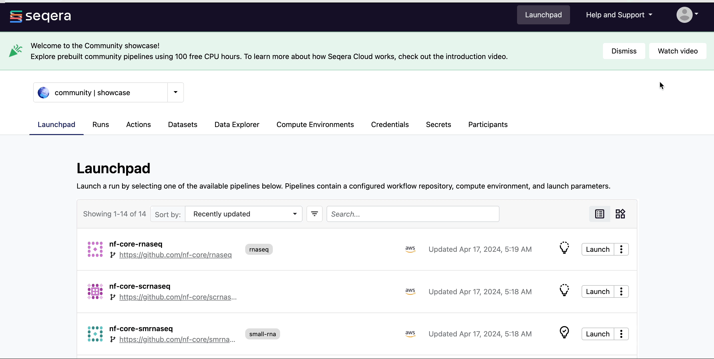

Seqera Platform provides multiple methods of programmatic interaction allowing you to automate execution of pipelines, chain pipelines together, and integrate the Platform into third-party services of your choosing.

### 1. Seqera Platform API

The Seqera Platform public API provides endpoints for performing all actions available on the interface, programmatically. The API can be accessed from `https://api.cloud.seqera.io`.

The full list of endpoints is available in Seqera's OpenAPI schema found [here](https://cloud.seqera.io/openapi/index.html). The API requires an authentication token to be specified in every API request. This can be created in your user menu under **Your tokens**.



The token is only displayed once. Store your token in a safe place. Use this token to authenticate requests to the API via cURL, Postman, or within your code.

For example, to launch the hello pipeline in the seqeralabs/showcase using the `/workflow/launch` endpoint:

```bash
curl -X POST "https://api.cloud.seqera.io/workflow/launch?workspaceId=38659136604200" \
    -H "Accept: application/json" \
    -H "Authorization: Bearer <your_access_token>" \
    -H "Content-Type: application/json" \
    -H "Accept-Version:1" \
    -d '{
    "launch": {
        "computeEnvId": "hjE97A8TvD9PklUb0hwEJ",
        "runName": "first-time-pipeline-api-byname",
        "pipeline": "first-time-pipeline",
        "workDir": "s3://nf-ireland",
        "revision": "master"
    }
}'
```

### 2. Seqera Platform CLI

The command line utility used to manage resources on Seqera Platform such as pipelines, runs, compute environments is called `tw`.

The CLI provides an interface to launch pipelines, manage compute environments, retrieve run metadata, and monitor runs on the Platform.It provides a Nextflow-like experience for bioinformaticians to prefer the CLI, allows you store Seqera resource configuration (i.e. pipelines, compute environments) in Infrastructure-as-code, and is built on top of the [Seqera Platform API](#1-seqera-platform-api). The CLI offers more flexibility and easier interaction with the Platform, than the API.


For example, to launch the hello pipeline using the CLI:

```bash
tw launch hello --workspace seqeralabs/showcase
```

The `tw` CLI installation and usage details can be obtained from [this](https://github.com/seqeralabs/tower-cli/) Github repository.

### 3. seqerakit

`seqerakit` is a Python wrapper for the Seqera Platform CLI which can be leveraged to automate the creation of all of the entities in Seqera Platform via a simple configuration file in YAML format.

The key features are:

- **Simple configuration**: All of the command-line options available when using the Seqera Platform CLI can be defined in simple YAML format.
- **Infrastructure as Code**: Enable users to manage and provision their infrastructure specifications.
- **Automation**: End-to-end creation of entities within Seqera Platform, all the way from adding an Organization to launching pipeline(s) within that Organization.

For example, to launch the hello pipeline using seqerakit, you can create a YAML file as follows:

```yaml
launch:
  - name: "hello-world"
    url: "https://github.com/nextflow-io/hello"
    workspace: "seqeralabs/showcase"
```

The `seqerakit` installation and usage details are available on [this](https://github.com/seqeralabs/seqerakit/) Github repository.
