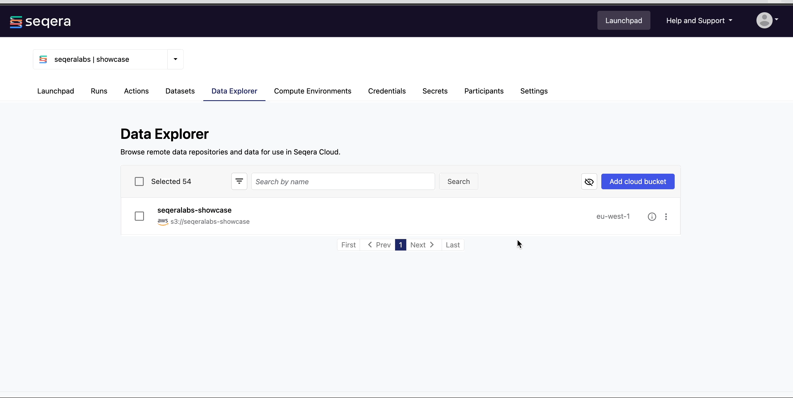

# Data Explorer

With Data Explorer, you can browse and interact with remote data repositories from organization workspaces in Seqera Platform. It supports AWS S3, Azure Blob Storage, and Google Cloud Storage repositories.

## 1. View pipeline outputs in Data Explorer

In Data Explorer, you are able to:

  - **View bucket details**:
    The cloud provider, bucket address, and credentials, by selecting the information icon next to a bucket in the Data Explorer list.

  - **View bucket contents**
    Select a bucket name from the Data Explorer list to view the contents of that bucket. 
    
    The file type, size, and path of objects are displayed in columns to the right of the object name. For example, we can take a look at the outputs of our nf-core/rnaseq run.

   

   - **Preview files**: 
    Select a file to open a preview window that includes a Download button. For example, we can use Data Explorer to view the results of the nf-core/rnaseq pipeline that we executed. Specifically, we can take a look at the resultant gene counts of the salmon quantification step:

## 2. Configure a bucket to browser in Data Explorer
Data Explorer also enables you to add public cloud storage buckets to view and use data from resources such as:

-  [The Cancer Genome Atlas (TCGA)](https://registry.opendata.aws/tcga/)
- [1000 Genomes Project](https://registry.opendata.aws/1000-genomes/)
- [NCBI SRA](https://registry.opendata.aws/ncbi-sra/)
- [Genome in a Bottle Consortium](https://docs.opendata.aws/giab/readme.html)
- [MSSNG Database](https://cloud.google.com/life-sciences/docs/resources/public-datasets/mssng)
- [Genome Aggregation Database (gnomAD)](https://cloud.google.com/life-sciences/docs/resources/public-datasets/gnomad) 

Select 'Add cloud bucket' from the Data Explorer tab to add individual buckets (or directory paths within buckets). 

Specify the Provider, Bucket path, Name, Credentials, and Description, then select Add. For public cloud buckets, select Public from the Credentials drop-down menu.

You are now able to use this data in your analysis without having to interact with Cloud consoles or CLI tools. 