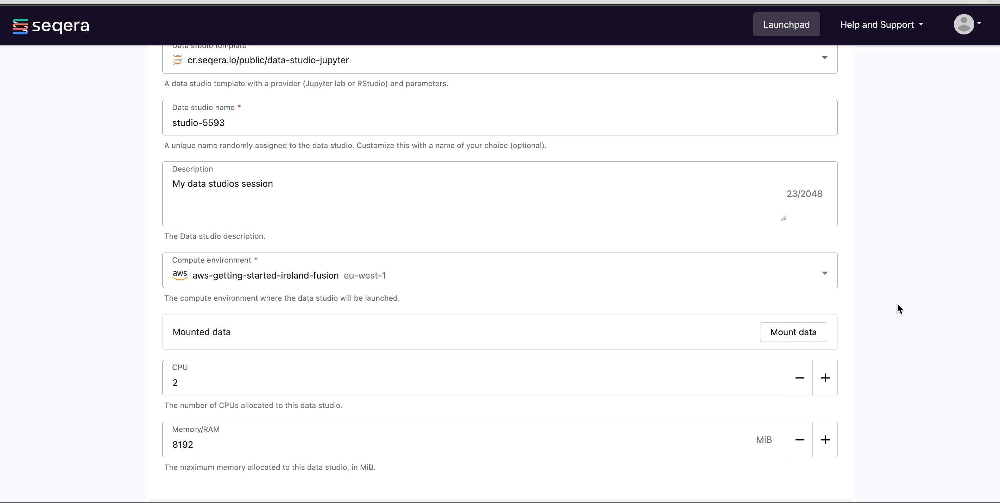
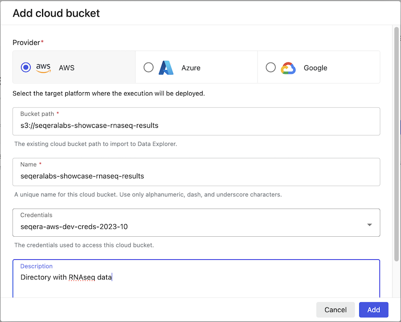

Data Studios is a unified platform where you can perform analysis of your pipeline results after successful execution. 

It allows you to host a combination of images and compute environments for interactive analysis using your preferred tools, like Jupyter notebooks, RStudio, and Visual Studio Code IDEs. 

Each data studio session is an individual interactive environment that encapsulates the live environment for dynamic data analysis.

## Data Studio Setup

### Create a Data Studio

#### 1. Add a Data Studio

To create a Data Studio, click on the 'Add data studio' button and select from any one of the three currently available templates.


#### 2. Select a compute environment

Currently, only AWS Batch is supported.

#### 3. Mount data using Data Explorer

Select data to mount into your data studios environment using the Fusion file system in Data Explorer. This data will be available at `/workspace/data/<dataset>`.

For example, to take a look at the results of your nf-core/rnaseq pipeline run, you can mount the value of the `outdir` parameter specified in the [earlier step when launching the pipeline](./launch_pipeline.md).



#### 4. Resources for environment

Enter a CPU or memory allocation for your data studios environment (optional). The default is 2 CPUs and 8192 MB of memory.

Then, click Add!

The data studio environment will be available in the Data Studios landing page with the status 'stopped'. Click on the three dots and **Start** to begin running the studio.


{ .right .image}

### Connect to a Data Studio

To connect to a running data studio session, select the three dots next to the status message and choose **Connect**. A new browser tab will open, displaying the status of the data studio session. Select **Connect**.
<br>
<div style="clear: both;"></div>

### Collaborate in Data Studio

Collaborators can also join a data studios session in your workspace. For example, to share the results of the nf-core/rnaseq pipeline, you can share a link by selecting the three dots next to the status message for the data studio you want to share, then select **Copy data studio URL**. Using this link other authenticated users with the "Connect" role at minimum, can access the session directly.
<div style="clear: both;"></div>

{ .right .image}
### Stop a Data Studio

To stop a running session, click on the three dots next to the status and select **Stop**. Any unsaved analyses or results will be lost.<br>
<div style="clear: both;"></div>

<br>
## Analyse RNAseq data in a Data Studio

Data Studio can be used to perform tertiary analysis of data generated by Nextflow pipeline executions on Seqera Platform. For example, we can take a look at our nf-core/rnaseq pipeline results in a Jupyter notebook to perform additional interactive analyses.

### 1. Create a Data Link
To enable access to our RNAseq analysis data in a Studio, we can create a custom data link pointing to the directory in our AWS S3 bucket where the results are saved. 

This can be achieved by using the 'Add cloud bucket' button in Data Explorer and specifying the path to our output directory:

{ .center }


### 2. Create a Jupyter notebook session 
When creating our Data Studio, we can mount our newly created Data Link to isolate read/write access to this directory within the studio session.


### 3. Data exploration in Jupyter
Once created, we can Connect to our Data Studio to open a Jupyter notebook session where we can take a look at the results of our RNAseq analysis. 

For example, in the notebook, you may first want to import Python libraries:

```python
import pandas as pd
```

We can load in our data from the analyses. For example, as a start, lets take a look at our transcript counts across the samples when loaded into a Pandas dataframe:

```python
data = pd.read_csv('data/seqeralabs-showcase-rnaseq-results/star_salmon/salmon.merged.gene_counts.tsv', sep='\t', index_col=0)
print(data.head())
```


Through Data Studios, you are now able to continue into the next step of your tertiary analyses, using data generated from pipelines executed on Seqera Platform but stored in the Cloud - without having to ever leave the Platform.

