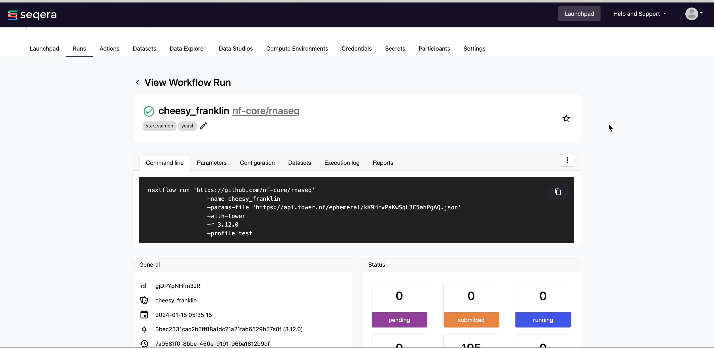

# Resuming a Run

Seqera Platform enables you to use Nextflow's resume functionality to resume a workflow run with the same parameters, using the cached results of previously completed tasks and only executing failed and pending tasks. If a Run fails or is Cancelled, click on the three dots next to the Run and select 'Resume' from the options menu. You will have the option to edit some parameters before launch. Unlike a relaunch, you cannot edit the pipeline to launch or the work directory during a run resume.

## 1. Change compute environment during run resume

Users with appropriate permissions can change the compute environment when resuming a run. The new compute environment must have access to the original run work directory.

This means that the new compute environment must have a work directory that matches the root path of the original pipeline work directory. For example, if the original pipeline work directory is s3://foo/work/12345, the new compute environment must have access to s3://foo/work.

## 2. Task Status and Cached Processes

The Runs page for a workflow will display the status of tasks in real time as they progress from 'Submitted' to 'Running' to 'Succeeded' or 'Failed'.

If you are resuming a run that had tasks that were completed successfully, you will see a number of tasks shown as 'Cached'.

